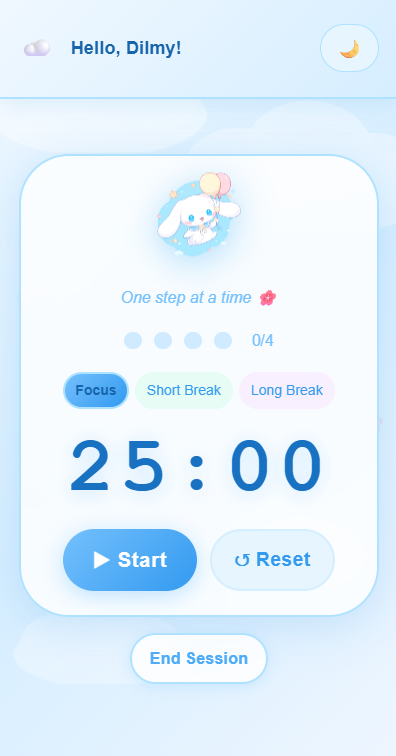
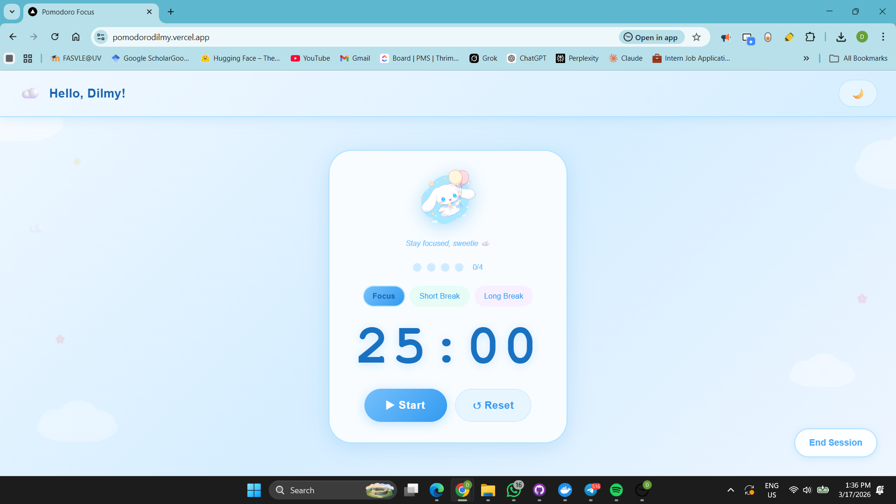
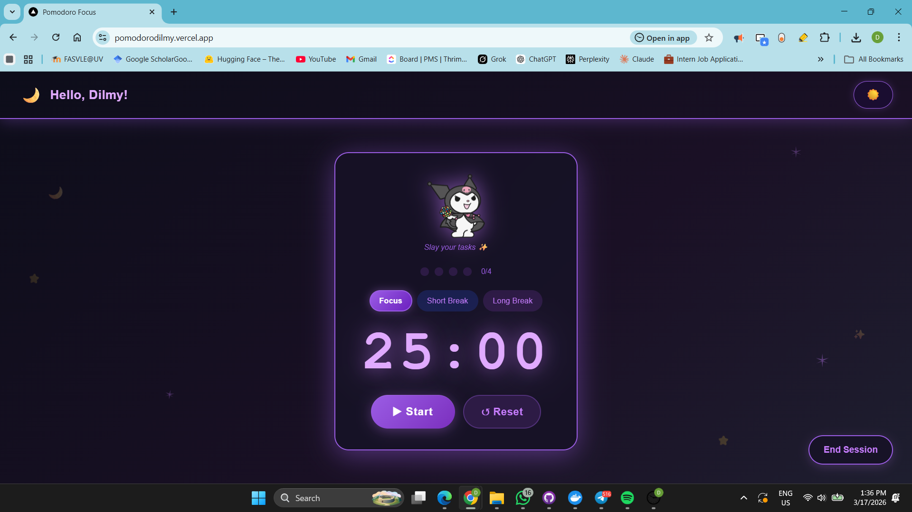

# Pomodoro Focus ⏳

A beautiful, simple, and fully **offline** Pomodoro Timer built as a **Progressive Web App (PWA)** — designed especially for students to stay focused and productive.

## ✨ Features

- **25/5/20 Pomodoro Technique** (Work + Short Break + Long Break)
- **Fully Installable PWA** – Works like a native mobile app
- **100% Offline Support** – Works even without internet
- **Beautiful & Clean UI** – Modern, minimal, and student-friendly design
- **Mobile Responsive** – Perfect experience on phones, tablets, and desktops
- **Dark Mode** – Easy on the eyes during late-night study sessions
- **Offline Indicator** – Know when you're working without internet
- **Customizable Timer Modes**
- **Progress Tracking** (Ready for future stats)

Perfect for students, freelancers, and anyone who wants to improve focus and manage study/work sessions effectively.

## 🚀 Live Demo

[Try Pomodoro Focus Now](https://pomodorodilmy.vercel.app/)  
*(Install it on your phone for the best experience!)*

## 🛠 Tech Stack

- **Framework**: [Next.js 16](https://nextjs.org/) (App Router)
- **Language**: TypeScript
- **Styling**: Tailwind CSS
- **PWA Features**: Web App Manifest + Service Worker (Official Next.js approach)
- **Deployment**: Vercel

## 📱 Why It's Great for Students

- Install directly on your phone home screen (feels like a real app)
- Works offline in classroom, library, or while traveling
- Clean, distraction-free interface
- No sign-up or account needed
- Lightweight and fast loading

## 🖼 Screenshots

| Mobile View | Desktop View | Dark Mode |
|-------------|--------------|---------|
|  |  |  |

## 🛠 How to Run Locally

```bash
# Clone the repository
git clone https://github.com/DilmyPerera/Pomodoro-Timer-PWA.git

# Go to project folder
cd Pomodoro-Timer-PWA

# Install dependencies
npm install

# Run development server
npm run dev
```

## 📦 Build for Production
``` bash
npm run build
npm run start
```

## 📄 License
This project is open source and available under the MIT License.
